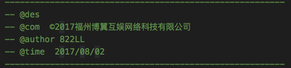
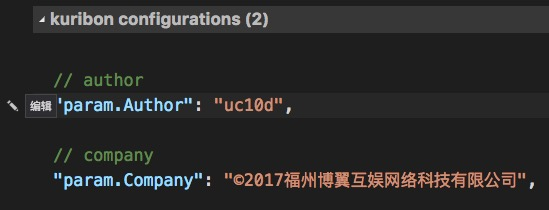
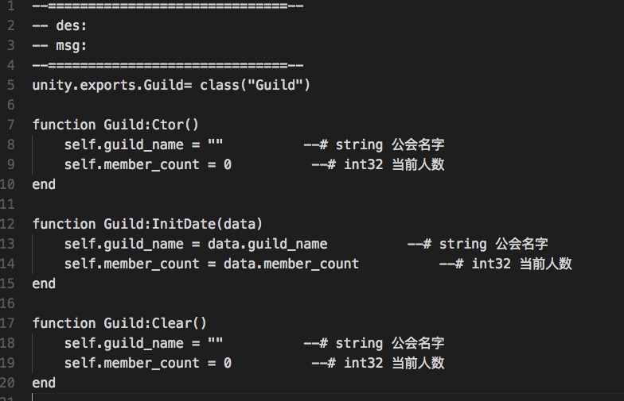

# Kuribon
A tool for lua（u3d）    
打包：vsce package    
开发适配mac，win下自测    
- - - - 
    1.lua文件头注释
    2.lua实体类生成器
- - - -
# 使用方法
 ##  1.lua文件头注释 : cmd + shift + 1
添加默认头部注释，提供2个可配置项，组织和个人。
        
修改配置参数：code - 首选项 - 设置      
        
点击编辑或者复制到右侧

## 2.lua实体类生成器: cmd + shift + 2
按快捷键，第一个窗口输入类名，支持第一个字母小写转大写。
弹出第二个输入窗口后，复制字段文档，按实际需求，所有有一定的局限性。    
吐槽下：输入框单一，不知道怎么修改。
有知道的请告知。
```
guild_id 	 # int64 公会id  
guild_icon 	 # int32 公会图标  
guild_level 	 # int32 公会等级  
guild_name 	 # string 公会名字  
member_count 	 # int32 当前人数  
```
复制后直接生成实体类代码。目前支持 int， string类型。    



## next step :       
    添加单字段    
    支持 List    
    req，res temple    
    剪切板...    
